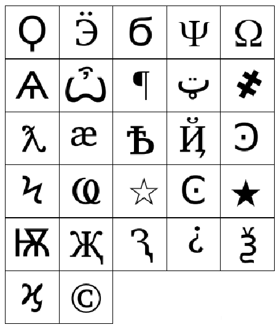

# Keep Talking And Nobody Explodes BOT
Este proyecto es un bot diseñado para asistir en el juego *Keep Talking and Nobody Explodes* (KTANE). Su objetivo es proporcionar ayuda rápida y precisa para resolver los módulos del juego.

## Características
- Asistencia en tiempo real para resolver módulos.
- Compatible con múltiples módulos del juego.
- Interfaz fácil de usar.

## Requisitos
- Python 3.8 o superior.
- Librerías necesarias (ver archivo `requirements.txt`).

## Instalación
1. Clona este repositorio:
	```bash
	git clone https://github.com/Luis06-py/KTANE-bot.git
	```

2. Instala las dependencias:
	```bash
	pip install -r requirements.txt
	```

## Ejemplo de uso
Primero configura el archivo JSON.
```json
{"calib": true}
```
En el caso de que el micrófono no reconozca la primera o última palabra, se puede decir "clave" y el bot descartará la palabra, por ejemplo si se dice **clave hola mundo**, interpretará **hola mundo**, pero si interpreta "clave", el bot eliminará la palabra.

Ejecuta el bot con el siguiente comando:
```bash
python main.py
```
Dentro el usuario se comunicará con el Bot y deberá proporcionarle indicaciones sobre los módulos para desactivar las bombas.
Se usará el abecedario fonético (es decir, Alpha, Bravo, Charlie... pero en español). Módulos:

### Etiquetado
#### Número de serie
- Comando: `número de serie`
- Se debe indicar el número de serie después del comando de voz, por ejemplo "Alfa Bravo Delta Hotel Tango Siete".
- **Consejo:** No es necesario decir todo el número completo. Solo importa si contiene vocales y cuál es el último dígito. Por ejemplo, con decir "*alfa siete*" es suficiente.

#### Indicador
- Comando: `indicador`
- Solo se debe mencionar los indicadores que tienen *tres letras*. Para cada uno, di las tres letras seguidas de la palabra "*Hecho*".
- Por ejemplo: "**Sierra Noviembre Delta Hecho**" representa *SND*, y "**Charlie Alfa Romeo Hecho**" representa *CAR*.
- Si no hay ningún indicador de tres letras, puedes decir cualquier cosa, como "**Noviembre Uniforme Lima Hecho**".

#### Baterías
- Comando: `baterías`
- Se debe decir dos números siendo "número1 luego número2", el primero correspondiente a la cantidad de baterías AA y el segundo a las baterías D.

#### Conectores
- Comando: `conectores`
- Se deben indicar los conectores que tiene la bomba, se deben indicar de esta forma: DVI (DVI-D), Paralelo, PS (PS/2), RJ (RJ-45), Serial, y Estéreo (o Stereo).

### Módulo de cables
- Comando: `número de cables`
- Se deben decir los colores de los cables en el orden que aparecen. El bot repetirá lo que has dicho para detectar errores.

### Módulo de El Botón
- Comando: `módulo de botón/módulo de botones`
- Se deberá indicar el color del botón y el texto. Es necesario identificar baterías o indicadores. Si el botón debe ser mantenido, preguntará al usuario por el color de la franja, que se deberá indicar.

### Módulo de memoria
- Comando: `módulo de memoria`
- Se deberá indicar primero el número grande y después en orden los cuatro números.

### Módulo de Quién Va Primero
- Comando: `módulo de primero`
- Se debe indicar primero el grupo y después las palabras en este orden.

|   |   |
|---|---|
| 1 | 2 |
| 3 | 4 |
| 5 | 6 |

#### Indicando el grupo
- Para indicar el grupo, se deben seguir unas reglas, esto es para evitar accidentes en palabras homófonas. Si se ve una letra se debe usar el abecedario fonético.

| Clave    | Valor  |
|----------|--------|
| HAYA H   | HAYA   |
| VAYA V   | VAYA   |
| VAYA B   | BAYA   |
| AHÍ A    | AHÍ    |
| AHÍ H    | HAY    |
| OKAY L   | OKAY   |
| OKAY     | OK     |
| HALLAR   | HALLA  |

- Nótese que esto es así porque el STT puede confundir *Baya* con *Valla*, entre otros.

#### Indicando las palabras
- Las palabras se deben indicar con este formato:
- Palabra **después** palabra *pregunta* **después**...
- En el caso de *esta*, se puede confundir con las tildes, para ello se debe decir **TILDE** dependiendo de su posición.

| Clave            | Valor |
|------------------|-------|
| ESTA             | ESTA  |
| ESTA TILDE       | ÉSTA  |
| ESTÁ TILDE TILDE | ESTÁ  |

- En el caso de interrogaciones, se debe decir **"PREGUNTA"** al final.

### Módulo de cables complicados
- Comando: `módulo de complicados.`
- Se deben indicar las características del cable (*Estrella*, *Luz*, *Rojo* y/o *Azul*, si no tiene nada es *nada*) y después decir **después**.
- Deben estar indicadas las baterías y los puertos.

### Módulo de Simón Dice
- Comando: `módulo de Simón`
- Dentro va a pedir la secuencia en bucle hasta que se diga *salir*.
- En el caso de fallo, se debe decir **fallo** para indicar que se ha cometido uno.

### Módulo de contraseñas
- Comando: `módulo de contraseña/s`
- Después se debe indicar la primera columna (en fonético), segunda columna, tercera columna...
- Si se quiere usar menos de cinco, se debe decir **hecho**.
- **Nota:** Si una letra puede corresponder a más de una opción parecida (por ejemplo, "Abajo" y "Atrás", que ambas empiezan con "A"), se elegirá siempre la primera opción en orden alfabético. En este caso, se tomará "*Abajo*".

### Módulo de teclados
- Comando: `módulo de teclado/s`
- Se deben decir los cuatro símbolos que aparecen en el teclado, diciendo "símbolo **DESPUÉS** símbolo...".
- Los símbolos se configuran en el archivo [`config.json`](./data/config.json) con un *ALIAS* personalizable. Los símbolos tienen una ID visible en la siguiente imagen:



|  1  |  2  |  3  |  4  |  5  |
| --- | --- | --- | --- | --- |
|  6  |  7  |  8  |  9  | 10  |
| 11  | 12  | 13  | 14  | 15  |
| 16  | 17  | 18  | 19  | 20  |
| 21  | 22  | 23  | 24  | 25  |
| 26  | 27  |     |     |     |

- Ejemplo de configuración:
	```json
	{
	  "símbolos": {
	    "QUESO": "1", "EURO VOLTEADO": "2", "6": "3"
	  }
	}
	```

## Módulo de Código Morse
- Comando: `módulo de Morse` o `módulo de morse`
- Después de decir el comando se debe indicar la secuencia en código Morse, separando cada símbolo con la palabra **después**, por ejemplo:
	- punto *después* punto línea *después* punto línea
- **Nota** se aconseja dar cuatro palabras, esto es porque si se usan tres, es posible que haya coincidencias parecidas y se devuelve la primera
	- `RAT`: **RAT**AS y T**RAT**O (Devolvería *ratas* cuando puede ser *trato*)

## Módulo de Secuencia de Cables
- Comando: `módulo de secuencia`
- Se deben decir las secuencias de los cables con este formato: *color conector **después** color conector*, siendo el conector en alfabeto fonético.
	- Ejemplo: `rojo alfa después azul bravo`
- Para salir se debe decir **salir**.

## Módulo de laberinto
- Comando: `módulo de(l) laberinto`
- Se deben decir primero las coordenadas de algún *círculo verde*, después las del *cuadrado* (posición) y por último las del *triángulo* (destino).
- La sintaxis para las coordenadas debe ser **número *después* número**.

## Módulo exigente de perillas
- Comando: `módulo de perillas`
- Se deben decir en orden las luces, **encendido** si la luz está encendida y **apagado** si está la luz apagada.

## Salida
```bash
$ python main.py
Iniciando bot de KTANE...
BOT: Estoy listo. ¿Qué necesitas?
Tú: conectores
BOT: Dímelo.
Tú: paralelo DVI estéreo
BOT: Hecho.
Tú: baterías
BOT: Dímelo.
Tú: dos luego uno
BOT: Hecho.
Tú: indicador
BOT: Dímelo.
Tú: noviembre uniforme Lima hecho
BOT: Hecho.
Tú: módulo de botón
BOT: Color y texto.
Tú: rojo mantener
BOT: Mantén el botón, ¿color de franja?
Tú: blanco
BOT: Suelta cuando haya un 1.
```

## Cosas a añadir:
- [X] Módulo de teclados (jeroglíficos)
- [X] Módulo de Simón Dice
- [X] Módulo de Código Morse
- [X] Módulo de Secuencia de Cables
- [X] Módulo de Laberinto
- [X] Módulo de Contraseñas
- [X] Módulo exigente de Perillas

## Licencia
Este proyecto está bajo la licencia MIT. Consulta el archivo [`LICENSE`](./LICENSE) para más detalles.
